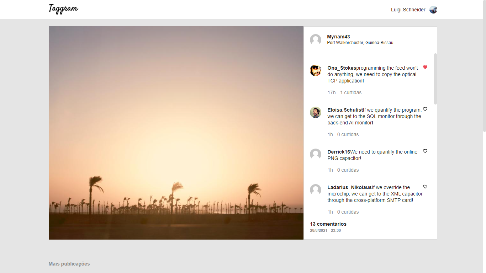
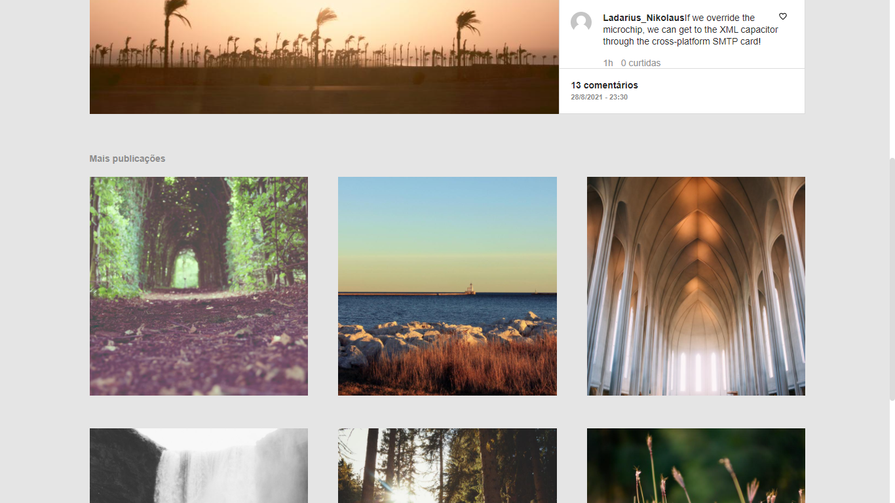

# taggram

- [Live Demo](https://edumigueis.github.io/taggram/)
>  A website developped in Vue.js 2 for the TagView front-end [challenge](https://github.com/tagview/taggram). Taggram consists of a post interaction app, the UI is based on the following design: [Figma Link](https://www.figma.com/file/96DdmM0aScr0uihjwx6LxM/Taggram?node-id=1598%3A14)

[](https://travis-ci.org/badges/badgerbadgerbadger) [](https://coveralls.io/r/badges/badgerbadgerbadger) 

[]()

## Installation

To download all dependencies and start using the project you will have to run:

```

npm install

```

To compile in development mode:

```

npm run serve

```

To run build:

```

npm run build

```

### Clone

- Clone this repo to your local machine using `https://github.com/edumigueis/taggram.git`
---

[]()